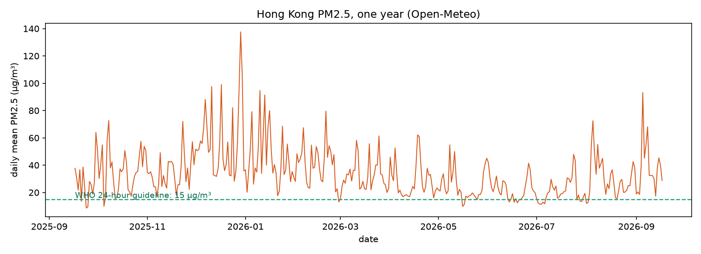

# Hong Kong haze



## The phenomenon

Haze in Hong Kong, measured as PM2.5 — fine particles small enough to reach the
lungs. It rises in winter and falls in summer, and I wanted to see that swing
with one year of numbers rather than one grey afternoon.

## The source

One year of hourly PM2.5 and PM10 for Hong Kong (22.32 N, 114.17 E), from the
Open-Meteo air quality API — no key needed. The raw reply is 8,784 hourly rows
of JSON, committed unchanged to `data/hk-pm25-2026.json`. Each value is a
concentration in µg/m³, estimated by a weather model.

## What the picture shows

The picture is 366 bars, one per day, standing on a dark ground. A clean day is
nearly invisible — its bar is almost the colour of the night — while a dirty
one flares orange, red and magenta, the tallest reaching 137.6 µg/m³ in
January. The middle of the year dims: summer is the only stretch where the
city's air quiets down. The claim the picture makes is simple — clean air is so
rare in Hong Kong that it nearly disappears, and the eye finds only the
pollution.

The picture hides two things. Each bar is a daily mean, so the worst single
hours of a day are smoothed away, and the numbers come from a model, not a
roadside monitor, so a real street is dirtier than the bars show.

## Run it

```
uv run fetch.py
uv run plot.py
```

`fetch.py` asks once and saves `data/hk-pm25-2026.json`; `plot.py` reads it and
writes `out/pm25-year.png`. The data is committed, so the plot runs offline.

## References

- Open-Meteo air quality API: https://open-meteo.com/en/docs/air-quality-api
- WHO global air quality guidelines: https://www.who.int/publications/i/item/9789240034228
